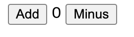

# Redux-tutorial

Learning Redux

## vanilla redux

```jsx
// src/index.js
const add = document.getElementById("add");
const minus = document.getElementById("minus");
const number = document.querySelector("span");

let count = 0;
number.innerText = count;

const updateText = () => {
  number.innerText = count;
};

const handleAdd = () => {
  count = count + 1;
  updateText();
};

const handleMinus = () => {
  count = count - 1;
  updateText();
};

add.addEventListener("click", handleAdd);
minus.addEventListener("click", handleMinus);
```

```html
<body>
  <button id="add">Add</button>
  <span></span>
  <button id="minus">Minus</button>
</body>
```



> 이 코드를 리덕스로 바꿔보자

### 사용하기

> npm add redux

1. reducer 를 만든다. 데이터를 modify 하는 함수이다.
   1. reducer 에 첫번째 인자는 state
   2. reducer 의 두번째 인자는 action: reducer와 소통하기 위한 함수

> action 사용하는 방법.

- store.dispatch() 메소드를 사용한다. 인자는 객체로 전달한다.
- dispatch는 해당 객체를 reducer의 action 으로 전달하고 reducer는 action 에 해당하는 modify를 한다.

1. store를 만든다 :
2. `createStore` 함수에 `reducer` 함수(countModifer)를 넣어준다
3. store.subscribe() 메소드를 사용해 데이터를 추적한다.
   - 인자로 함수를 넘긴다. 데이터가 변하면 해당 함수를 실행한다.(보통 업데이트하는 함수를 전달)

> store 란? <br>
> 데이터를 저장하는 장소이다 ex)state<br>
> reducer 란? <br>
> 데이터를 modify 하는 함수이다. <br>
> reducer가 리턴하는 값이 새로운 데이터값이 된다.
> reducer 는 현재의 state와 함께 불려진다

```jsx
// redux 적용
import { createStore } from "redux";

const add = document.getElementById("add");
const minus = document.getElementById("minus");
const number = document.querySelector("span");

number.innerText = 0;

const countModifier = (count = 0, action) => {
  console.log(count, action);
  if (action.type === "ADD") {
    return count + 1;
  } else if (action.type === "MINUS") {
    return count - 1;
  } else {
    return count;
  }
};

const countStore = createStore(countModifier);

const onChange = () => {
  number.innerText = countStore.getState();
};

countStore.subscribe(onChange); // 구독

const handleAdd = () => {
  countStore.dispatch({ type: "ADD" });
};

const handleMinus = () => {
  countStore.dispatch({ type: "MINUS" });
};

add.addEventListener("click", handleAdd);
minus.addEventListener("click", handleMinus);
```
